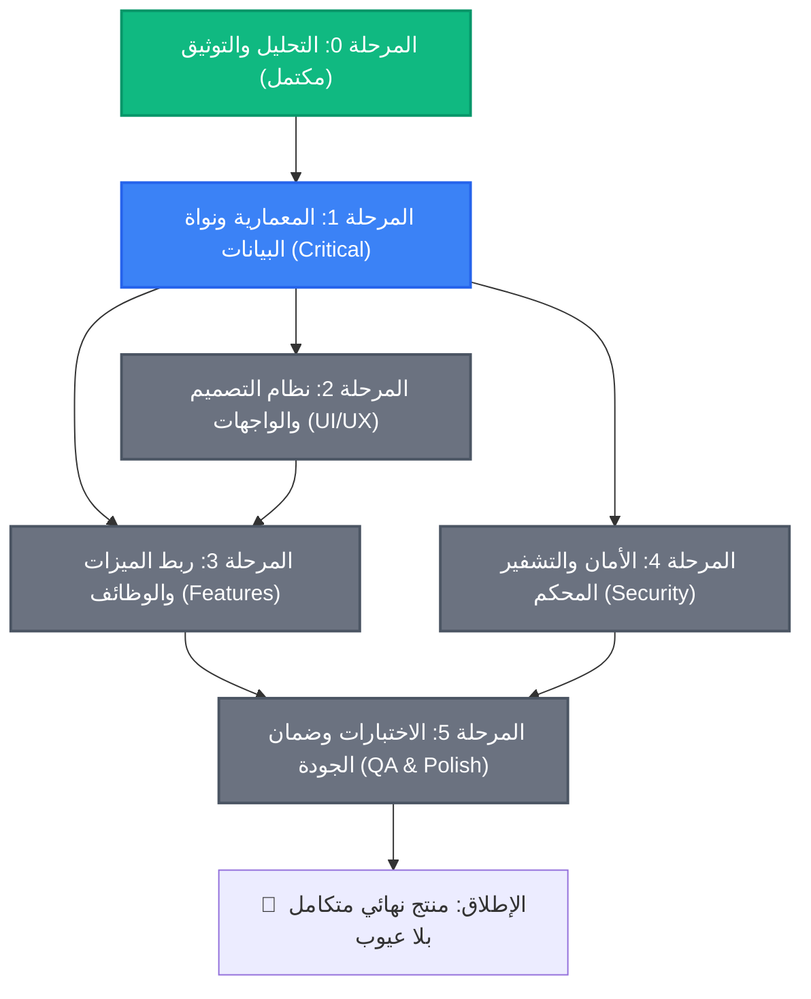

# 🗺️ الجدول الزمني ومسار المراحل — Phases & Timeline Roadmap

> **الهدف:** توفير خارطة طريق واضحة ومحددة زمنياً ومعمارياً لتنفيذ خطة تطوير تطبيق BASHNDDOF  
> **المبدأ الأساسي:** التدرج الآمن (Non-breaking Incremental Implementation) — التطبيق يظل قابلاً للبناء والتشغيل بعد كل مرحلة.

---

## 🧭 مخطط الاعتماديات بين المراحل (Phases Dependency Graph)

---

## 🚦 بوابات الجودة وشروط الانتقال (Definition of Done & Gates)

لكل مرحلة معايير صارمة (Exit Criteria) لا يتم الانتقال للمرحلة التي تليها قبل تحققها بنسبة 100%:

| المرحلة | متطلبات الإغلاق الإلزامية (Gate Requirements) |
|---------|-----------------------------------------------|
| **المرحلة 1: المعمارية** | 1. لا وجود لأي ملفات مكررة في شجرة الكود. 2. تشغيل `flutter analyze` بدون أي أخطاء أو تحذيرات حرجة. 3. قاعدة بيانات واحدة موحدة تفتح وتغلق بدون تسريب. 4. جميع نماذج البيانات تدعم `fromMap` و `toMap` مع معالجة القيم الفارغة (null-safety). |
| **المرحلة 2: التصميم** | 1. نظام ألوان موحد عبر الثيم بدون استخدام ألوان عشوائية hardcoded. 2. دعم كامل وتلقائي للوضعين الداكن والفاتح. 3. لوحة مفاتيح تفاعلية ومؤثرات لمسية (haptic) على الأزرار. 4. نصوص عربية منسقة بضبط اتجاه RTL سليم 100%. |
| **المرحلة 3: الميزات** | 1. المعاملات تُحفظ وتُعدل وتُحذف وتنعكس فورياً على الرصيد والميزانية. 2. الأظرف تتفاعل بدقة مع المصروفات وتغير أشرطة التقدم حسب المتبقي. 3. التقارير تعرض رسوماً بيانية تفاعلية دقيقة مستقاة من بيانات SQLite الحقيقية. 4. المعاملات المتكررة يتم رصد استحقاقها بنجاح. |
| **المرحلة 4: الأمان** | 1. رمز PIN مشفر بخوارزمية اشتقاق قوية ومخزن في التخزين الآمن فقط. 2. قفل التطبيق فوراً عند تسجيل عدد محاولات فاشلة محدد. 3. منع لقطات الشاشة في الشاشات المالية الحساسة. 4. إمكانية تصدير نسخة احتياطية مشفرة واستعادتها بنجاح. |
| **المرحلة 5: الجودة** | 1. تغطية الاختبارات الآلية للعمليات الحسابية وقاعدة البيانات. 2. تجربة التطبيق على أحجام شاشات متعددة بدون أي Overflow بكسل أصفر. 3. معدل إطارات سلس وثابت (Smooth 60/120 FPS). |

---

## 📅 المسار التنفيذي التفصيلي (Step-by-Step Implementation Roadmap)

### 🧱 الحزمة 1: النواة وتوحيد البيانات (Core & Data Unification)
* **الهدف:** التخلص من الفوضى، إيقاف التكرار، وتوفير طبقة بيانات صلبة لكل الشاشات.
* **المخرجات:**
  - مستودع كود نظيف بدون شاشات أو قواعد مكررة.
  - ملف `lib/src/core/database/app_database.dart` الموحد بجميع الجداول.
  - مجلد `lib/src/core/models/` بنماذج مكتملة مدعومة بالـ copyWith و JSON/Map serialization.
  - طبقة Repositories متكاملة للعمليات الأساسية (CRUD).

### 🎨 الحزمة 2: نظام التصميم وثيم التطبيق (Design System & Theming)
* **الهدف:** تحويل التطبيق إلى واجهة فاخرة تنافس أرقى التطبيقات المالية العالمية (Modern Fintech UI).
* **المخرجات:**
  - لوحة ألوان زمردية راقية (Deep Emerald, Mint Accent, Slate Backgrounds).
  - خط عربي مخصص عالي المقروئية (Cairo / Readex Pro).
  - مكتبة أزرار، بطاقات مالية، وأشرطة تقدم حركية سلسة.
  - إعادة بناء الشاشات التمهيدية والدخول (Intro, PIN Setup, Login).

### ⚡ الحزمة 3: لوحة التحكم وشاشة المعاملات (Dashboard & Transactions)
* **الهدف:** تفعيل قلب التطبيق — رؤية الرصيد الحقيقي وإضافة المعاملات وحفظها.
* **المخرجات:**
  - بطاقة الرصيد الإجمالي التفاعلية مع إحصائيات الشهر الحالي.
  - شاشة إضافة معاملة متطورة مع اختيار التصنيف، التاريخ، الملاحظات، ونوع المعاملة (دخل/مصروف).
  - قائمة المعاملات الأخيرة مع دعم التمرير للبحث والتصفية.

### 📊 الحزمة 4: الأظرف، أهداف الادخار، والتقارير (Envelopes, Savings & Reports)
* **الهدف:** بناء ميزات الإدارة المالية المتقدمة.
* **المخرجات:**
  - نظام تقسيم الميزانية على الأظرف مع تنبيهات عند تجاوز الحد المسموح.
  - شاشة أهداف الادخار مع بطاقات تقدم تحفيزية.
  - شاشة تقارير احترافية مدعومة بمخططات `fl_chart` (Pie, Bar, Area charts).

### 🛡️ الحزمة 5: الأمان وإدارة الجلسة والنسخ الاحتياطي (Hardening & Backup)
* **الهدف:** توفير راحة بال تامة للمستخدم عبر حماية بياناته ومحفظته.
* **المخرجات:**
  - تأمين كامل لـ PIN مع دعم البصمة عبر `local_auth`.
  - ميزة النسخ الاحتياطي المشفر بملف خارجي والاستعادة السريعة.
  - إعدادات إدارة البيانات (إعادة الضبط الشاملة مع تأكيد أمني).

### ✨ الحزمة 6: الاختبارات، التلميع النهائي، والإطلاق (Testing & Polish)
* **الهدف:** تقديم منتج مكتمل بنسبة 100% خالٍ من أي عيب برمجي أو بصري.
* **المخرجات:**
  - حزمة اختبارات Units و Widgets.
  - تفاعلات حركية ناعمة، اهتزازات لمسية haptic، و SnackBar عصرية.
  - مراجعة توافق المقاسات والشاشات الصغيرة والكبيرة.

---

## 🛡️ استراتيجية التنفيذ الآمن بدون كسر المشروع (Zero-Breakage Strategy)

لضمان عدم توقف المشروع أثناء التطوير:

1. **التحقق المستمر من البناء (Continuous Build Health):**
   - بعد أي عملية حذف أو نقل ملفات، يتم تشغيل `flutter analyze` فوراً للتحقق من عدم وجود مراجع تالفة.
2. **عزل التغييرات الكبيرة:**
   - عند بناء الشاشات الجديدة، يتم تطوير الـ Widgets المساعدة كعناصر مستقلة في مجلد `shared/` قبل دمجها بالشاشة الرئيسية.
3. **التشغيل المتوازي للبيانات قبل الإحلال:**
   - تفعيل `AppDatabase` الموحد وتجربته عبر كود الاختبار قبل حذف ملفات قواعد البيانات القديمة نهائياً.

---

## 🎯 إعلان الجاهزية

بهذا تكتمل منظومة التخطيط المكونة من **8 وثائق استراتيجية متكاملة** داخل المجلد:
`bashnddof/development_plan/`

المشروع الآن مهيأ بنسبة 100% للانتقال إلى **المرحلة 1: التنفيذ البرمجي المباشر**.
